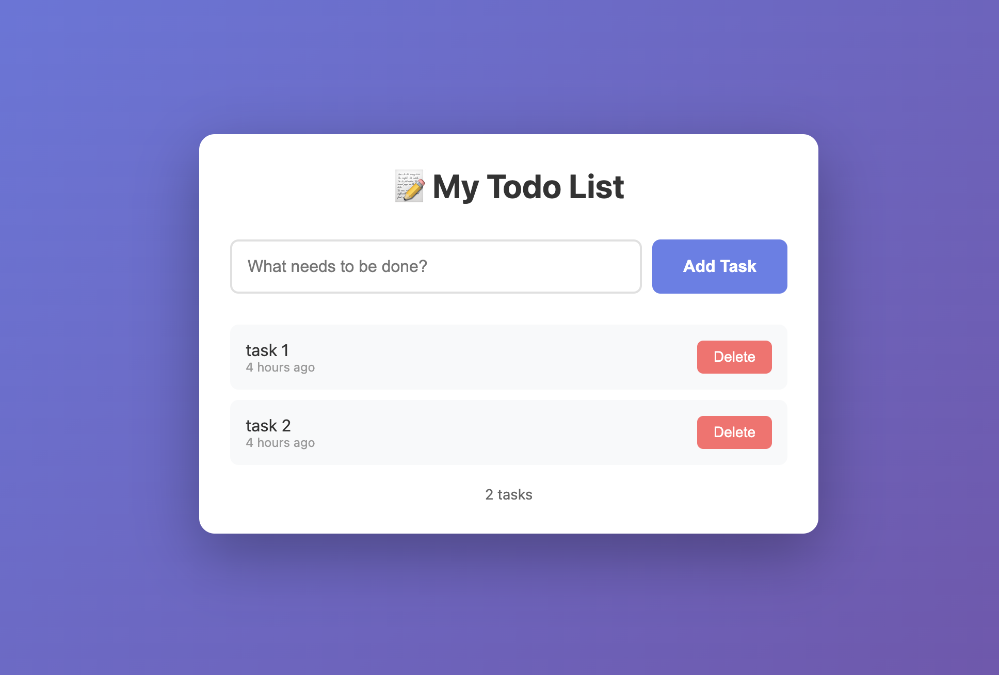

# simple-todo-app

A todo app with web UI built with Flask.

## App UI



## Run with Docker

```bash
# Build image
docker build -t simple-todo-app .

# Run container
docker run -d -p 5000:5000 simple-todo-app

# Open browser: http://localhost:5000
```

## Run Locally

```bash
# Create virtual environment
python3 -m venv venv

# Activate virtual environment
source venv/bin/activate

# Install dependencies
pip install -r requirements.txt

# Run app
python3 app.py

# Open browser: http://localhost:5000
```
